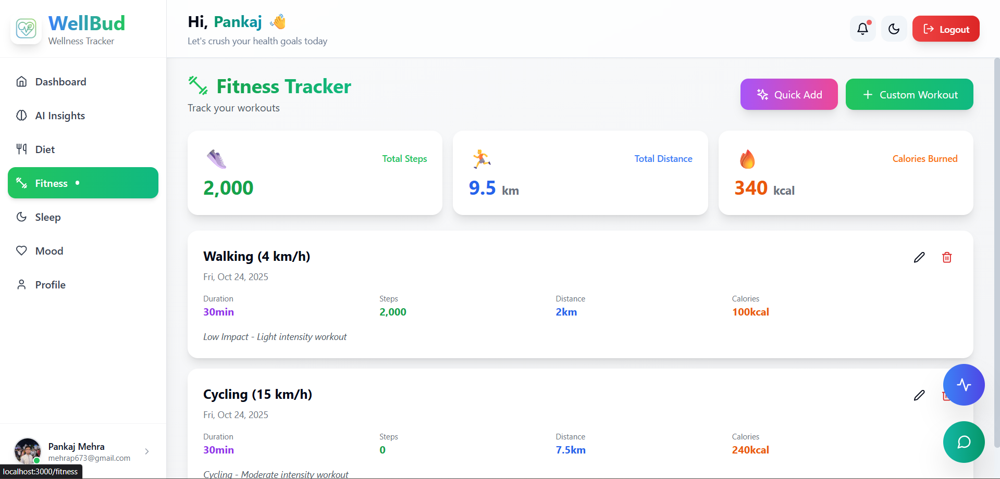

# 🏥 WellBud — Wellness Buddy

**AI-Powered Health Tracking & Wellness Companion**

WellBud is your personal AI-powered wellness partner that helps you take control of your daily health.  
Track your **diet**, **fitness**, **sleep**, and **mood**, and receive **personalized insights** powered by **Google Gemini AI** — all in a beautiful, responsive glassmorphism interface.

---

## 🌟 What It Does

- 🍽 **Tracks** your daily diet, workouts, sleep, and mood effortlessly  
- 🤖 **Delivers AI-driven insights** and health recommendations  
- 📊 **Identifies patterns & correlations** in your health data  
- 💡 **Provides actionable tips** for lifestyle improvement  
- 💬 **AI Chat & Symptom Checker** for instant health assistance  
- 🔐 **Supports Google Login** and secure authentication  
- 💻 **Responsive Glassmorphism UI** that looks stunning on any device  

---

## 🚀 Key Features

### 🧠 AI Health Insights  
Get a personalized health story, view your trends, and receive recommendations powered by **Google Gemini AI**.

### 📝 Multi-Category Logging  
Quickly log your **meals, workouts, sleep patterns, and mood** with an intuitive interface.

### 📈 Smart Analytics  
Track your **streaks, progress, and consistency** at a glance with visual analytics.

### 💬 Symptom Checker  
Instantly analyze symptoms using AI to better understand your health.

### 🎨 Modern UI/UX  
Clean, animated, and mobile-friendly **glassmorphism design** built for comfort and clarity.

### 🔒 Secure & Private  
Includes **Google OAuth**, **JWT-based authentication**, and **environment variable security** for user data protection.

---

## 🧩 Tech Stack

| Category | Technology |
|-----------|-------------|
| Frontend | React, Tailwind CSS, Framer Motion, Lucide Icons |
| Backend | Node.js, Express.js |
| Database | MongoDB |
| AI Integration | Google Gemini AI |
| Authentication | Google OAuth 2.0, JWT |
| Deployment | Vercel / Render / MongoDB Atlas |

---

## 🛠️ Installation & Setup

1. **Clone the Repository**
   ```bash
   git clone https://github.com/mehrap673/wellbud.git
   cd wellbud
Install Dependencies

bash
Copy code
npm install
Setup Environment Variables
Create a .env file in the root directory and add:

env
Copy code
MONGO_URI=your_mongodb_connection_string
JWT_SECRET=your_jwt_secret
GOOGLE_CLIENT_ID=your_google_client_id
GOOGLE_CLIENT_SECRET=your_google_client_secret
GEMINI_API_KEY=your_google_gemini_api_key
Run the Application

bash
Copy code
npm run dev
Open in Browser
Visit http://localhost:3000

## 📸 Screenshots

### 🏠 Dashboard


### 🧠 AI Insights


### 💬 Chat Assistant


### 🩺 Symptom Checker


### 🍽️ Diet Tracker


### 🏋️ Fitness


### 🌙 Sleep Tracking


### 💖 Mood Tracker


### 👤 Profile


🤝 Contributing
Contributions, issues, and feature requests are welcome!
Feel free to fork the repo and submit a pull request.

🧠 Inspiration
Health tracking should be smart, simple, and personal.
WellBud combines the power of AI with modern web technologies to help users make better health choices every day.

💚 Crafted with care by [Pankaj Mehra]

“Your health companion, powered by AI — because wellness should feel effortless.”